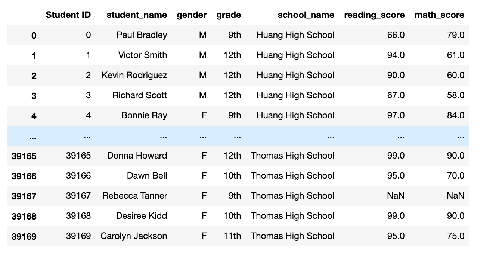
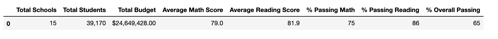
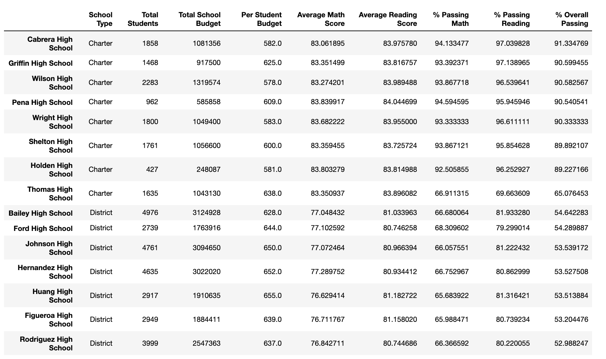
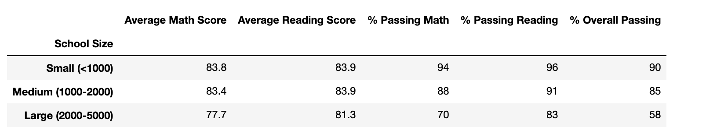
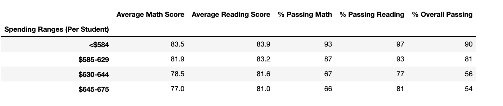
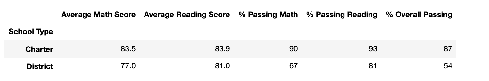

# School District Analysis

## Overview
The purpose of this analysis is to analyze students' math and reading standardized test scores of 15 different schools as well as look at their funding, schoolsize, and school type (charter vs district) to help determine funding for the coming school year.

## Results
We started to analyze all the schools with the test results that were given but later found out there were some discrepancies with Thomas High School’s test scores. We were able to test a separate code to ignore their math and reading scores from Thomas High School and merge the new data frame into the original analysis code. 

<imag src="Resources/Overall_Snapshot.png">

We can see the following after running our new dataframe through our code:

- district summary:
  The average math score went from 79.0 to 78.0.
  The % passing math went down from 75% to 74%
  The % passing reading went down from 86% to 85% 
  And the overall pass percent when down from 65% to 64%
  

Overall there was minimal impact on the district summary, however the average reading score was unaffected by the change. 

- School Summary:
  Avg math 83.4 now 83.3
  Avg reading 84 now 84
  Percent passing math was 93 now its 66
  Percent passing reading was 97 now 69
  Overall was 91 now 65
  
  
 School summary is only change as to Thomas High School scores shows

    - How does replacing the ninth graders’ math and reading scores affect Thomas High School’s performance relative to the other schools?
    The school data dataframe was placed in ascending order based on the % Overall of passing. Thomas High School was ranked 2nd    place but after we updated the 9th graders math and reading skills, they moved to 8th place. This had a big impact on the        scores from the whole school’s academic performance.

    - How does replacing the ninth-grade scores affect the following:
      Math and reading scores by grade
      Original Thomas High School math: 83.590022 
      New: nan
      Original Thomas High School reading: 83.728850
      New: nan
 

     - Scores by school spending
      At the $630 to $644 rangeThe older version showed the same average scores as our updated version but the percentage of math went down from 73% to 67% and the percentage of passing reading went down from 84% to 77% . Likewise the overall percent passing went down from 63% to 56% in this range.
 

     - Scores by school size
      Medium school sizes percentages were affected. Originally % passing math was 94% now 88%, reading was 97% now 91% and overall was 91% to 85%.
 

      - Scores by school type
       As Expected from updating Thomas high School, which is a chater school, the charter school category was affected by the data clean up. The % passing math was 94% now 90%, % passing reading was 97% now 93% and the overall percent passing was 90% now 87%.

## Summary
The major changes that occurred due to the update in data from Thomas High School was the change to math and reading scores by grade, scores by school spending, scores by school size, and scores by school type.
